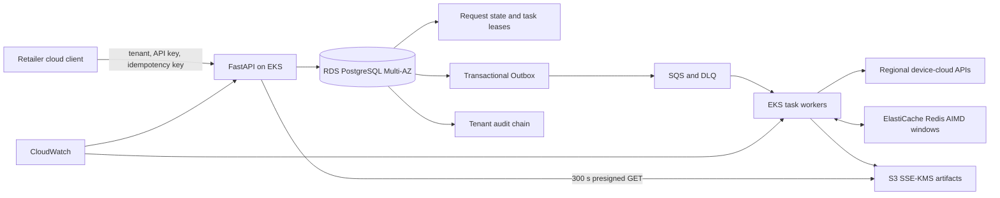

# FleetPrivacy Control Plane

## 项目解决的问题

联网设备厂商为多个企业客户运营设备云。企业客户在员工离职、账号注销或收到数据主体请求时，需要导出或删除某个人的全部关联数据。这些数据分散在账户、设备操作归属、身份关联遥测、任务发起记录和支持工单等区域服务中。逐个系统开工单容易漏项；某个区域执行失败后，人工重跑还可能重复已经完成的删除，最终也缺少一份能够交付给客户的完成证明。

FleetPrivacy 为企业客户的合规门户提供统一后端接口。门户只提交一次人员标识和请求类型，服务便会定位五类数据、分别执行导出或删除，并持续显示每个数据源的进度。访问请求最终生成 KMS 加密的数据包；删除请求返回每个数据源的删除数量、剩余数量和执行回执。Worker 中断、区域接口限流和客户端重复提交都由任务租约、幂等键与持久化回执收敛。

典型流程：零售商关闭一名门店操作员账号并提交删除请求。FleetPrivacy 在同一事务中创建五路任务，区域 Worker 完成删除后反向查询剩余记录。某个 Worker 中途退出时，其余任务在租约到期后由其他 Worker 接管。客户重复提交原请求会取得同一请求编号，已完成数据源保持一次执行。

## Business overview

FleetPrivacy is the backend service behind a connected-device vendor's privacy request portal. Enterprise customers use it when an account is closed, a former employee asks for a copy of personal data, or a compliance team must remove a data subject from every regional system. The same identity can appear in the account profile, device ownership and assignment records, telemetry annotations, job-creator history and support tickets. Handling only the account table leaves linked records behind; retrying a partially completed deletion can repeat side effects and still provide no proof of what was removed.

The API accepts one data-access or deletion request, locates the subject across five data domains, executes each source action independently and returns either an encrypted export or a source-by-source deletion receipt. The caller can see which sources completed, which source is retrying and whether a reverse query found remaining records. Every state change is retained in a tenant audit chain for customer support and compliance review.

### Example business flow

A retailer closes a store-operator account and submits one Delete request with its tenant ID, subject ID and idempotency key. FleetPrivacy creates five source tasks in the same database transaction, sends them to regional workers and limits each upstream service according to its observed capacity. If a worker exits after three sources finish, another worker reclaims the remaining leases. The completed request reports the deleted and remaining record counts for every source. Repeating the original HTTP request returns the same request ID and performs zero additional source actions.

This gives the device-cloud team one accountable path for account closure, data-subject access requests and deletion requests across regional services. The project combines device onboarding, regional API collection and deployment problems found in large retail IoT estates with an AWS control plane. Its capacity model follows Hanshow's reported deployment scale of more than 55,000 stores across over 70 countries.

## Production path



Each service owns one concrete state:

- **RDS PostgreSQL:** requests, tenant-scoped idempotency keys, task owner/lease/attempt, Outbox rows, source receipts and the audit-chain head.
- **SQS:** committed task wake-up events, visibility deadlines, receive counts and DLQ transfer after repeated failure.
- **ElastiCache Redis:** one atomic AIMD concurrency window per tenant and regional source, updated through Lua with TTL.
- **S3 and KMS:** versioned Access JSON artifacts, SSE-KMS encryption and SHA-256 object metadata.
- **EKS:** separately scaled API and worker deployments, Pod Identity, probes, disruption budgets and rolling replacement.
- **CloudWatch:** RDS pressure, Redis eviction/CPU, SQS queue age and DLQ alarms with direct operator actions.

The Terraform stack creates a three-AZ VPC, private EKS nodes, RDS PostgreSQL 16 Multi-AZ, Redis with one primary and two replicas, SQS/DLQ, encrypted S3, KMS, Secrets Manager and workload-specific IAM. The Helm chart separates API and worker service accounts and mounts secrets through the AWS CSI provider.

## Request and recovery contract

1. FastAPI validates tenant, command and `Idempotency-Key`.
2. One PostgreSQL transaction inserts the request, five source tasks, one `privacy_task.ready` Outbox event per task and the first audit event.
3. Parallel relays use `FOR UPDATE SKIP LOCKED`; a row receives `published_at` only after SQS confirms the send.
4. A worker claims the database task by `task_id`, persists owner, lease and attempt, and extends both SQS visibility and the database lease while processing.
5. Regional connectors use HTTPS and a Secrets Manager service token, then send tenant, request and task idempotency headers. Redis stores the shared tenant/source AIMD window so multiple worker Pods converge on the same upstream capacity.
6. Access aggregates source receipts into an S3 object. Delete performs tenant-scoped mutation followed by a reverse query for remaining active rows.
7. The API returns a five-minute presigned S3 URL. Every request and task transition is appended to the per-tenant audit chain.

The database task row absorbs SQS duplicate delivery. A relay exit after SQS send produces another wake-up event and zero additional execution for a terminal task. A worker exit leaves both message visibility and database lease to expire; another worker reclaims the same task. If an Access task commits before its S3 artifact is recorded, the repeated message rebuilds the deterministic object without incrementing the task attempt.

Regional HTTP failures reset the task to `pending` for the first four attempts and leave the SQS message unacknowledged. The fifth failure persists a terminal receipt; SQS moves the repeatedly delivered message to the DLQ under the configured redrive policy.

## Implemented engineering mechanisms

- FastAPI, Pydantic, async SQLAlchemy and explicit PostgreSQL connection-pool sizing.
- `(tenant_id, idempotency_key)` uniqueness plus request-body equivalence checks.
- `FOR UPDATE SKIP LOCKED` task claims and Outbox relay.
- SQS long polling, visibility heartbeat, successful-only acknowledgement and DLQ infrastructure.
- S3 `PutObject` with SSE-KMS, SHA-256 metadata and short-lived presigned GET.
- Redis Lua updates for tenant/source AIMD state and an expiring sorted-set admission lease, plus measured 429-driven multiplicative decrease.
- Tenant ID in request, task, record, Outbox, audit and every resource lookup predicate.
- Per-tenant audit sequence, previous hash, payload hash and advisory transaction lock.
- Terraform, Helm, Docker/LocalStack, readiness/liveness probes, HPA, PDB, CloudWatch alarms and CI.

## Measured results

The committed PostgreSQL 16 workload used 100 tenants, 50 concurrent clients, 1,000 requests and 5,000 source tasks:

| Result | Measurement |
| --- | ---: |
| request admission | 63.03 requests/s |
| create latency | P50 715.5 ms, P95 1,272.3 ms, P99 1,655.1 ms |
| source-task processing | 31.78 tasks/s |
| completed requests | 1,000 / 1,000 |
| idempotent replays returning original ID | 1,000 / 1,000 |
| additional task attempts after replay | 0 |
| audit chains passing full recomputation | 100 / 100 |

Additional committed experiments:

- **Worker termination:** all five leased tasks were reclaimed after expiry, completed on attempt 2 and added zero attempts on idempotent replay.
- **Tenant isolation:** 10,000 cross-tenant resource probes returned 10,000 HTTP 404 responses; all 100 same-tenant controls returned HTTP 200.
- **AWS adapters:** LocalStack/Redis processed and acknowledged 500 SQS messages with zero queue residue, stored 100/100 S3 objects with SSE-KMS and SHA-256 metadata, and completed 1,000 atomic Redis window updates.
- **Connector overload:** with source capacity 8, fixed concurrency 32 produced 988 first-attempt HTTP 429 responses across 1,000 operations; AIMD produced 25, a 97.47% reduction, and raised accepted throughput from 28.53 to 432.11 operations/s.

Machine-readable results are stored in [`benchmarks/benchmark_results`](benchmarks/benchmark_results). The workload definitions and interpretation are in [benchmark.md](docs/benchmark.md).

## Quick start

### Local application

```bash
python -m venv .venv
source .venv/bin/activate
python -m pip install -e '.[dev]'
uvicorn privacy_cloud.main:app --reload
pytest -q
```

SQLite and local artifact files are the default adapters for a short development loop.

### AWS-compatible integration stack

```bash
docker compose -f compose.aws-test.yml up --build -d
curl http://localhost:8000/v1/healthz
python benchmarks/run_aws_adapter_integration.py
```

The stack starts PostgreSQL 16, Redis 7, LocalStack SQS/S3/KMS, the API and the queue worker. LocalStack creates the primary queue, DLQ, redrive policy, KMS alias, encrypted S3 bucket and public-access block.

### AWS deployment

```bash
cd infra/aws
cp backend.hcl.example backend.hcl
cp terraform.tfvars.example terraform.tfvars
terraform init -backend-config=backend.hcl
terraform validate
terraform plan -out=production.tfplan
terraform apply production.tfplan
```

Deployment topology, service responsibility, IAM and failure drills are documented in [aws-production.md](docs/aws-production.md).

## Repository guide

```text
src/privacy_cloud/       API, state machine, AWS adapters and source connectors
tests/                   idempotency, tenant, recovery, SQS/S3 and AIMD tests
benchmarks/              load, fault, isolation, connector and AWS integration runs
infra/aws/               three-AZ AWS Terraform
deploy/aws/              API/worker Helm chart
deploy/localstack/       local AWS resource bootstrap
docs/                    architecture, benchmark and interview deep dives
```

## Engineering references

FleetPrivacy combines patterns from [Full Stack FastAPI Template](https://github.com/fastapi/full-stack-fastapi-template), [Fides](https://github.com/ethyca/fides) and [Amazon S3 Find and Forget](https://github.com/awslabs/amazon-s3-find-and-forget). Attribution and license details are recorded in [NOTICE](NOTICE). FleetPrivacy is released under the [MIT License](LICENSE).
